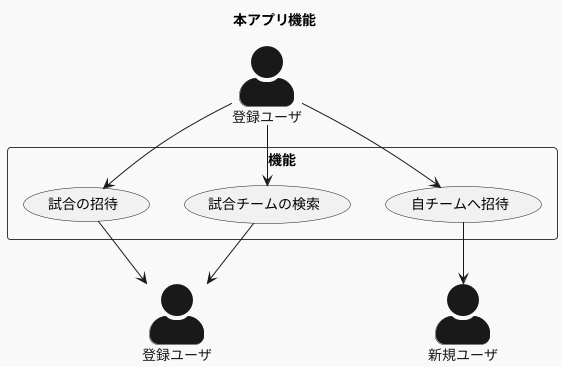

# OnlineDatingWithSportsアプリケーション

```plantuml
@startuml
title 本アプリ機能
!theme mars
skinparam actorStyle awesome
actor 登録ユーザ as g
actor 登録ユーザ as g2
actor 新規ユーザ as ng

rectangle "機能" {
    usecase "試合チームの検索" as ts
    usecase "試合の招待" as cg
    usecase "自チームへ招待" as ct
}


:g:-->ts
:g:-->cg
:g:-->ct

:ts:-->g2
:cg:-->g2
:ct:-->ng
@enduml
```

